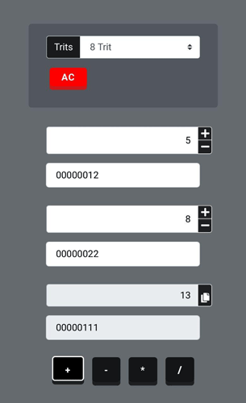
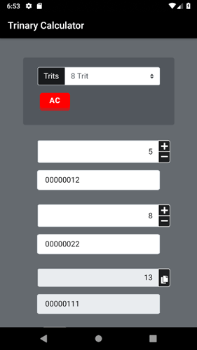

# [0️⃣1️⃣2️⃣ Trinary Calculator JavaScript 2️⃣1️⃣0️⃣](https://ayidouble.github.io/Trinary-Calculator-JavaScript/)

**Link** : **[https://ayidouble.github.io/Trinary-Calculator-JavaScript](https://ayidouble.github.io/Trinary-Calculator-JavaScript)** 
**Mobile App** : **[https://github.com/AYIDouble/Trinary-Calculator-Android-Java-App](https://github.com/AYIDouble/Trinary-Calculator-Android-Java-App)** 
**Official Google Play Store Download Link** : **[https://play.google.com/store/apps/details?id=com.trinarycalculator.ayidouble.trinarycalculator.app](https://play.google.com/store/apps/details?id=com.trinarycalculator.ayidouble.trinarycalculator.app)**

📱 A handy **Calculator** for Trinary operations, that works on **all devices** 📱 💻 🖥

Feel free to use the **Calculator** for teaching Numeral systems as an example.
If you have Suggestions or find Errors, you're free to contact me on GitHub or submit your changes.
The Reason why I build this **Calculator** was, because there wasn't a good one on the Web.
The next Project will be a ternary **Calculator** for ternary calculations with trytes and trits,
this will be a perfect template to create such one.
## [📱 Mobile (Smartphone): 📱](https://ayidouble.github.io/Trinary-Calculator-JavaScript)

## [💻 Destkop: 🖥](https://ayidouble.github.io/Trinary-Calculator-JavaScript)

**[The Trinary Calculator is just a Website](https://ayidouble.github.io/Trinary-Calculator-JavaScript)** that each possible device can access to. 
## ***You can use the Trinary Calculator on your: 📱 💻 🖥***
- ***[Smartphone](https://ayidouble.github.io/Trinary-Calculator-JavaScript) (Android/iOS etc.) 📱***
- ***[Tablet](https://ayidouble.github.io/Trinary-Calculator-JavaScript) (Chrome, Firefox, Edge, Safari) 📱***
- ***[Laptop](https://ayidouble.github.io/Trinary-Calculator-JavaScript) (Chrome, Firefox, Edge, Safari) 💻***
- ***[Destkop](https://ayidouble.github.io/Trinary-Calculator-JavaScript) (Chrome, Firefox, Edge, Safari) 🖥***

## [📱 FREE Download Google Play Store: 📱](https://play.google.com/store/apps/details?id=com.trinarycalculator.ayidouble.trinarycalculator.app)

## Trinary Operations ➕ ➖ ➗ ✖️

- **\+ (Addition)**
- **\- (Subtraction)**
- **\* (Multiplication)**
- **\/ (Division)**

- **! (NOT)** ex. ! 10101010 = 01010101
- **<< (Bitwise Left Shift)** ex. 1010 << 0101
- **\>\> (Bitwise Right Shift)** ex. 1010 >> 0101

- **AND / NAND**
- **OR / NOR**
- **XOR / XNOR**

## As efficient as possible ⚙️

The **Calculator** is designed to give responses on every action,
this is noticeable as an example at the addition of two Bytes,
while you're typing, an algorithm already calculates every number you type and displays the result.

## The Calculator allows you to ⛓

- see how Hexdecimal Values are stored in Trinary (ex. HTML Color Codes RGB(**255**, **255**, **255**) = RGB(**8-Bit**, **8-Bit**, **8-Bit**))
- how much **8, 16, 32 Bit** can store, (ex. unsigned **8-Bit** can store values from **(00000000) 0 ... 255 (11111111)**)
- see how other numeral systems are working (**ternary**, **quaternary**, **octal**, **hexdecimal**)
